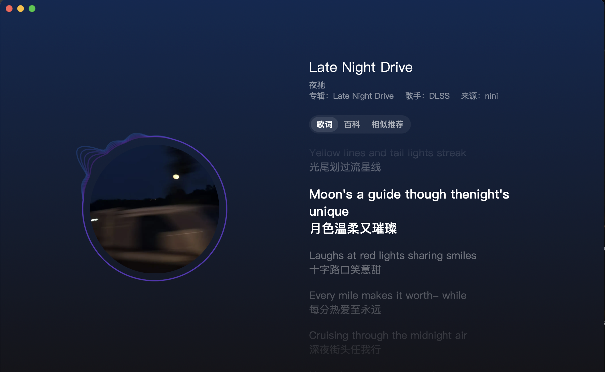
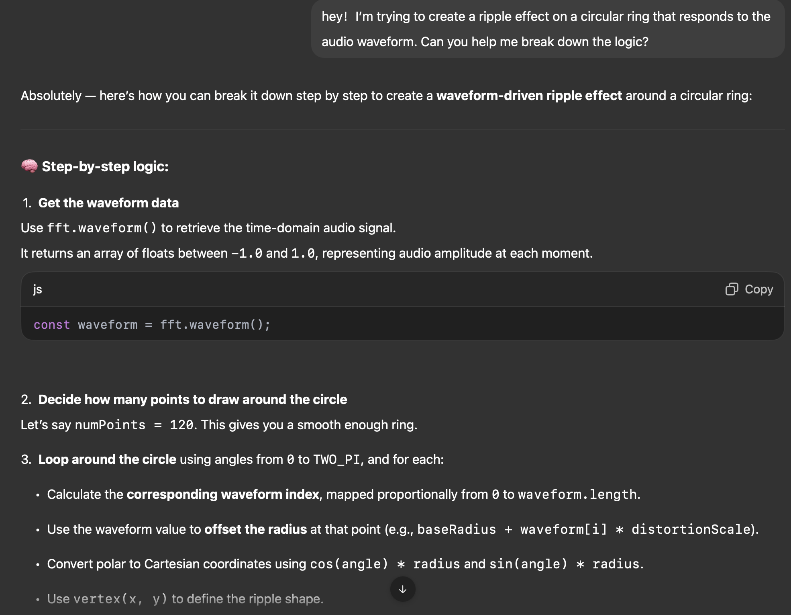

# **Wheel of Fortune – Audio-Driven Animation**

**By: Danni**

## **How to Interact**

Here is the **user guide** for experiencing my individual audio-driven contribution to the group project:

1. **Click the “Play / Pause” button** at the bottom of the screen to start or stop the music playback.
2. Once the audio begins, **all visual wheels on the canvas will pulsate** — expanding and contracting — in real time based on the **bass frequency energy** of the sound.
3. The **two outermost rings** of each wheel will display **circular ripple distortions** generated using the waveform data, producing a visual echo of the music.
4. When the bass intensity is **above a certain threshold**, you’ll see **particles emitted** from the edges of the outer rings. These particles disperse and gradually fade away, adding a sense of motion and energy decay.

> 📝 Note: All interactions are passive except for clicking the play button — the animations respond automatically to the music. The canvas also resizes responsively with the browser window.
> 

---

## **My Individual Animation Approach**

### **Animation Driver:Real-Time Audio**

My animation is fully driven by the music that plays in the background. I use the p5.sound library’s FFT (Fast Fourier Transform) capabilities to extract real-time audio data, which I use to control several visual elements:

---

### **1.Bass-Responsive Scaling**

Using fft.getEnergy("bass"), I extract the current **bass frequency energy** (typically 60–250 Hz). This value is mapped to a scaling range of 0.9 to 1.0 and applied to every decorative wheel to create a subtle **pulsing effect** that synchronizes with the rhythm.

```jsx
let energy = map(fft.getEnergy("bass"), 0, 255, 0.9, 1);
window.scaleOverride = energy;
```

The scale factor is passed into each wheel via:

```jsx
DecorateWheels.drawWheel(c, scaleFactor);
```

This makes all the wheels feel like they’re “breathing” with the beat.

---

### **2.Waveform-Driven Ripple Distortion**

I apply additional visual distortion to the **two outermost rings** of each wheel using the raw waveform data from fft.waveform(). This creates a **radial ripple effect** — like an audio echo — around each wheel, using beginShape() and vertex() to dynamically distort the circular outline based on the waveform’s amplitude at each angle.

```jsx
const waveOffset = waveform[waveIndex] * 25;
const r = waveR + waveOffset;
vertex(cos(angle) * r, sin(angle) * r);
```

---

### **3.Conditional Particle Emission (Bass > 180)**

To make the visuals even more dynamic, I added a **particle system** that emits small colored particles from the outer layers of each wheel — but only when two conditions are met:

- Music is currently playing
- The bass energy exceeds a threshold (> 180)

Each particle fades out and moves outward with a randomized velocity, adding to the visual rhythm.

```jsx
if (sound.isPlaying() && fft.getEnergy("bass") > 180) {
  // emit particle
}
```

---

### **Summary of My Unique Approach**

- **Control Mechanism**: Audio → FFT (energy + waveform)
- **Affected Visuals**: Ring scaling, waveform ripple, particle system
- **Visual Signature**: Dynamic, beat-synced, immersive energy

Compared to my teammates, each of us approached the animation from a unique angle:

- **I** used **real-time audio input** to drive all of my animations. My visuals respond dynamically to bass energy and waveform data, resulting in synchronized scaling, circular ripple distortion, and rhythmic particle bursts.
- **Regina** took an **interactive approach**, designing animations that respond directly to **mouse input**, allowing the user to influence the visual outcome manually.
- **Yaqi** employed **Perlin noise** to create smooth, continuously shifting motion patterns that give the visuals an organic, flowing quality over time.

This diversity in approach allowed us to explore different generative animation strategies while maintaining a shared visual structure.

---

## **References & Inspirations**

My work was inspired by a blend of **course materials**, **daily music app experiences**, and **creative community examples**. Below are the three key references that informed my individual animation approach:

### **1. Course Tutorial – Week 12: Sound in p5.js**

The foundation of this project comes from **Week 12’s p5.js sound tutorial**, where we were introduced to:

- Using fft.getEnergy() to retrieve real-time audio energy (particularly in the bass range)
- Visualizing sound through fft.waveform()
- Building a playback interface that responds to browser autoplay restrictions

These lessons directly influenced my implementation of **bass-driven scaling**, **waveform ripples**, and **conditional audio-triggered behavior** in the animation.

---

### **2. Music Player UI – NetEase Cloud Music**

As someone who listens to music daily, I’ve always been drawn to the aesthetic of **NetEase Cloud Music’s player interface**. Its clean waveform visualizations and flowing rings inspired my idea to implement **circular ripple distortions** around the wheel’s outer layers.



This inspiration guided me to convert raw waveform data into polar coordinates, allowing the ripple shape to move with the beat — just like modern music visualizers do.

---

### **3. Particle Design – “Other Side of the Black Hole” (OpenProcessing)**

I discovered this [audio visualizer sketch on OpenProcessing](https://openprocessing.org/sketch/1614870) by sudhanshu and was immediately inspired by its **vortex-style particle movement**.

In particular:

- The way particles emit from waveform outlines
- The radial distribution using p5.Vector.random2D()
- The fade-out and edge detection logic

I adapted these ideas to my own system: particles are only emitted when the bass energy is intense (above 180), and they slowly fade and disperse, creating a dynamic ambient rhythm.

```jsx
if (sound.isPlaying() && fft.getEnergy("bass") > 180) {
  // emit particle from outer ring
}
```

This added an expressive, high-energy visual response tied directly to the music’s intensity.

---

### **4. Visual Symbolism – “Wheel of Fortune” in Tarot**

Beyond technical and aesthetic inspirations, the **conceptual foundation** of my work draws from the **“Wheel of Fortune” card in Tarot symbolism**.


- The wheel represents the **cyclical nature of fate** — a system constantly in motion, governed by forces beyond our control.
- I used **pulsing circles**, **waveform ripples**, and **bass-triggered particle emissions** to metaphorically express this idea: a rhythm of change that is unpredictable yet patterned.
- The visual elements of rotation and expansion serve as **symbolic echoes of chance, timing, and the unknown** — just like the card’s meaning.

This metaphor gave the animation an emotional and philosophical dimension, aligning the **form of the code with the feeling of fate**.

---

## **Technical Explanation**

This section outlines the core technical methods I used to animate the wheels with audio input. My implementation relies on three key mechanisms from the p5.sound library: **FFT spectrum analysis**, **waveform data**, and **audio state tracking**.

---

### **FFT Initialization & Sound Setup**

In danni's_work.js, I initialize the sound engine and FFT object like so:

```jsx
let fft = new p5.FFT(smoothing, numBins);
sound.connect(fft);
```

- numBins = 64: controls the resolution of the frequency spectrum.
- smoothing = 0.8: helps average out abrupt changes for smoother visuals.
- sound.connect(fft): pipes audio into the FFT analyzer.
- A global scaleOverride is calculated from fft.getEnergy("bass") and used to control wheel size.

---

### **drawWheel(c, scaleFactor)**

The DecorateWheels.drawWheel() function accepts a scaleFactor argument, which is computed from the bass energy and applied to all components of the wheel:

```jsx
const radius = c.radius * scaleFactor;
```

This value dynamically resizes each layer of concentric rings and their decorative dots, resulting in a synchronized pulsing effect across the entire canvas.

---

### **Waveform Ripples**

For the outer two layers (waveLayers = [0, 1]), I draw distorted rings using fft.waveform():

```jsx
const waveOffset = waveform[waveIndex] * 25;
const r = waveR + waveOffset;
vertex(cos(angle) * r, sin(angle) * r);
```

- Each ripple consists of 120 points (numPoints) plotted in polar coordinates.
- The waveform is mapped to a circular ring, modulating each vertex outward/inward to form a ripple.

To implement the waveform-driven ripple effect for the outer rings, I used ChatGPT to assist in structuring the core logic.

I decided to use ChatGPT for this part because, after reviewing the Week 12 tutorial and relevant p5.js documentation, I found that the course materials did not provide an example that mapped waveform data into polar space to generate circular distortion.



ChatGPT helped translate the concept into code-friendly steps, including:
	•	Mapping waveform amplitude values (from fft.waveform()) to radius offsets
	•	Using polar coordinates (cos(angle) and sin(angle)) to draw rippling circles
	•	Structuring a beginShape() loop for smooth, continuous circular animation

I then customized and implemented the logic myself — selecting which layers to apply it to, adjusting the intensity of the ripple, and integrating it into the group’s wheel-drawing function.

---

### **Particle System**

Particles are conditionally emitted only when:

1. The sound is playing.
2. The bass energy exceeds 180.

```jsx
if (sound.isPlaying() && fft.getEnergy("bass") > 180) {
  // create and push particle
}
```

Each particle:

- Spawns from a random angle along one of the outer two layers
- Has a random outward velocity (vx, vy)
- Fades out over time (alpha -= 4)
- Is removed once it becomes fully transparent

Rendering logic is handled in the main draw() loop and uses a global window.particles[] array.

---

### **Modular Integration**

- The audio logic is decoupled from the rendering logic via window.scaleOverride.
- The system remains modular and extendable — I only added to drawWheel(), without breaking group code.
- Responsive design is retained via CanvasManager and windowResized()

---

## **Changes Made to Group Code**

To integrate my audio-driven features into the existing group codebase, I made a few focused, non-destructive modifications:

---

### **1.drawWheel()Function Extension (groupcode_danni.js)**

- I **extended** the group-defined DecorateWheels.drawWheel() function to accept a new parameter: scaleFactor.
- This allowed the radius of each wheel to be scaled dynamically in response to audio input, without altering the group’s layout logic or structure.

```jsx
drawWheel: function(c, scaleFactor = 1) {
  const radius = c.radius * scaleFactor;
  ...
}
```

> 🔸 All group visuals (rings, dots, center circle) now respond to this scaling factor.
> 

---

### **2. Added Audio Ripple Effects to Two Outer Layers**

- I added a waveform()-based ripple effect on **layer 0 and 1** (outermost and second layer).
- The effect is purely additive — it overlays visual distortions without modifying the original layer drawing logic.
- This was implemented using beginShape() and vertex() in polar coordinates.

---

### **3. Embedded Particle System**

- I added logic to emit **particles from the outer rings** when the music is playing and bass energy is high.
- Particle logic is self-contained and rendered in the main draw() loop (danni's_work.js).
- I used a shared global array (window.particles) to manage and render particles without requiring integration into group modules.

---

### **4.scaleOverride**

#### **Bridge Variable**

- I introduced a global variable window.scaleOverride to **bridge** the audio analysis (danni's_work.js) and the wheel rendering system (groupcode_danni.js / circleSystem).
- This approach allowed me to inject dynamic scaling into the existing draw loop without restructuring the group’s architecture.

---

#### **Non-Destructive Integration**

- All group-defined logic for canvas setup (CanvasManager), layout (circleSystem), and drawing structure was preserved.
- My changes are **additive and isolated**, ensuring compatibility with Yaqi and Regina’s contributions.

---

## **External Tools & Techniques**

While the majority of my implementation is grounded in the **course-provided libraries and frameworks**, I did explore some external techniques for enhanced creativity and inspiration.

---

### **Tools Used Within Course Scope**

- **p5.js**
    
    Core creative coding framework used for canvas drawing and animation logic.
    
- **p5.sound**
    
    Built-in audio library used for real-time sound analysis. I primarily used:
    
    - p5.FFT() for frequency spectrum and waveform data
    - fft.getEnergy() for bass-driven behavior
    - fft.waveform() for ripple visualization

These are all officially supported by the course and introduced in Week 12.

---

### **External Techniques Adapted**

### **1.Waveform-to-Circle Distortion (Conceptual Adaptation)**

Inspired by waveform visualizations in apps like NetEase Cloud Music, I adapted the typical linear waveform into **polar coordinates** to create a circular ripple:

```jsx
const r = baseRadius + waveform[index] * distortionScale;
const x = cos(angle) * r;
const y = sin(angle) * r;
```

Although the math (trig-based polar drawing) wasn’t directly shown in class, it’s built using **core JavaScript and p5.js methods**.

---

### **2.Particle System Design (from OpenProcessing)**

I drew inspiration from the OpenProcessing sketch [“Other Side of the Black Hole”](https://openprocessing.org/sketch/1614870), especially in how particles:

- Emerge from circular motion paths
- Use p5.Vector.random2D() to initialize directional motion
- Fade out gradually with alpha -= value
- Get removed from the array once invisible

I implemented a **simplified, customized version** of that system, using only core p5.js logic and without importing any external dependencies.

---

### **ChatGPT as a Development Companion**

While all the **creative ideas and design directions** in this project were my own, I relied on **ChatGPT** as a helpful assistant throughout the implementation process.

It supported me in the following ways:

- Helping me **clarify and organize animation logic** when my ideas became complex.
- Explaining how certain p5.js functions or JavaScript syntax work in detail.
- Assisting in **debugging conflicts or errors** I encountered while integrating audio features.
- Providing **step-by-step guidance** when I wasn’t sure how to approach a specific implementation.

This collaborative process allowed me to not only complete my animation goals, but also **learn and understand the code more deeply**, rather than just copy and paste.

---

